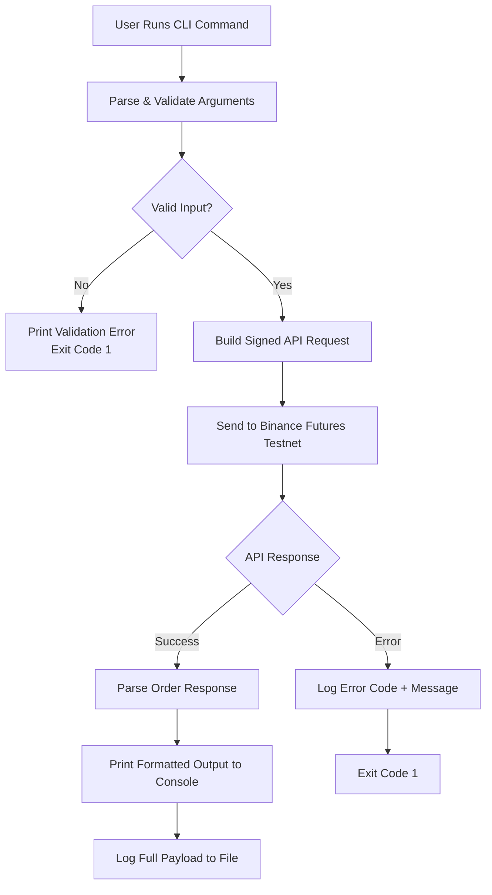
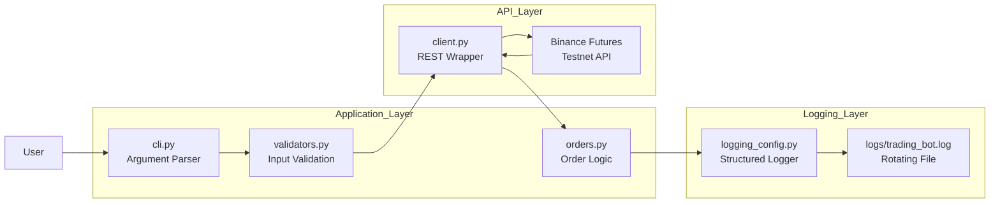
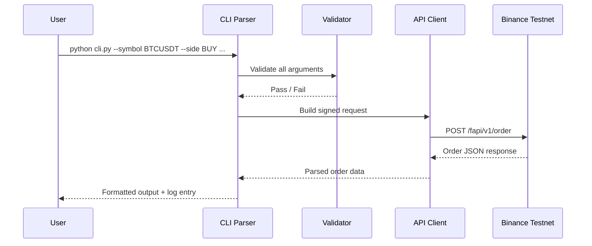

<p align="center">
  
</p>

<p align="center">
  <b>⚡ Automate Futures Trading — Market, Limit & Stop Orders via Raw REST API</b>
</p>

<p align="center">
  
  
  
  
  
</p>

---

## 📌 Overview

**TradeBot AI** is a command-line Python application that places **Market**, **Limit**, and **Stop** orders on the **Binance USDT-M Futures Testnet** — with zero third-party SDKs. All API interactions are raw REST calls via `requests`, making the codebase fully transparent and dependency-light.

Built for traders and developers who want full control over order execution without the overhead of heavyweight libraries.

> **Testnet URL:** [`https://testnet.binancefuture.com`](https://testnet.binancefuture.com)

---

## 🏗️ Project Structure

```
trading_bot/
├── bot/
│   ├── __init__.py
│   ├── client.py          # Binance Futures REST API wrapper
│   ├── orders.py          # Order placement logic
│   ├── validators.py      # Input validation
│   └── logging_config.py  # Structured logging setup
├── cli.py                 # CLI entry point
├── logs/
│   └── trading_bot.log    # Auto-generated log file
├── README.md
└── requirements.txt
```

---

## 🔄 Order Execution Flow



---

## ☁️ Architecture Overview



---

## 🔁 Request Lifecycle



---

## 🚀 Setup

### Prerequisites

- Python 3.10+
- A [Binance Futures Testnet](https://testnet.binancefuture.com) account

### 1. Generate Testnet API Credentials

1. Visit [https://testnet.binancefuture.com](https://testnet.binancefuture.com)
2. Log in / register
3. Go to **API Key Management** → generate a key pair
4. Copy your **API Key** and **Secret Key**

### 2. Install Dependencies

```bash
pip install -r requirements.txt
```

### 3. Set Credentials

**Option A — Environment variables (recommended):**

**Bash (macOS/Linux):**
```bash
export BINANCE_TESTNET_API_KEY="your_api_key_here"
export BINANCE_TESTNET_API_SECRET="your_api_secret_here"
```

**PowerShell (Windows):**
```powershell
$env:BINANCE_TESTNET_API_KEY="your_api_key_here"
$env:BINANCE_TESTNET_API_SECRET="your_api_secret_here"
```

**Option B — Pass directly on every command:**
```bash
python cli.py --api-key YOUR_KEY --api-secret YOUR_SECRET ...
```

---

## 💻 Usage

```
python cli.py --symbol SYMBOL --side BUY|SELL --type ORDER_TYPE --quantity QTY [--price PRICE] [--stop-price STOP_PRICE]
```

### Arguments

| Argument | Required | Description |
|---|---|---|
| `--symbol` | ✅ | Trading pair, e.g. `BTCUSDT` |
| `--side` | ✅ | `BUY` or `SELL` |
| `--type` | ✅ | `MARKET`, `LIMIT`, `STOP_MARKET`, or `STOP_LIMIT` |
| `--quantity` | ✅ | Order quantity in base asset |
| `--price` | ⚠️ | Limit price — required for `LIMIT` and `STOP_LIMIT` |
| `--stop-price` | ⚠️ | Trigger price — required for `STOP_MARKET` and `STOP_LIMIT` |
| `--base-url` | ❌ | API base URL (defaults to Binance Futures Testnet) |
| `--api-key` | ✅* | API key (or use env var) |
| `--api-secret` | ✅* | API secret (or use env var) |

---

## 📋 Examples

### Market BUY

```bash
python cli.py --symbol BTCUSDT --side BUY --type MARKET --quantity 0.001
```

**Expected output:**
```
────────────────────────────────────────────────────────────
📋  ORDER REQUEST
────────────────────────────────────────────────────────────
  Symbol    : BTCUSDT
  Side      : BUY
  Type      : MARKET
  Quantity  : 0.001
────────────────────────────────────────────────────────────
✅  ORDER PLACED SUCCESSFULLY
────────────────────────────────────────────────────────────
📄  ORDER RESPONSE
────────────────────────────────────────────────────────────
  Order ID      : 3281947
  Status        : FILLED
  Executed Qty  : 0.001
  Avg Price     : 63482.10
```

---

### Limit SELL

```bash
python cli.py --symbol BTCUSDT --side SELL --type LIMIT --quantity 0.001 --price 70000
```

---

### Stop-Market BUY *(Bonus order type)*

```bash
python cli.py --symbol BTCUSDT --side BUY --type STOP_MARKET --quantity 0.001 --stop-price 60000
```

---

### Stop-Limit BUY *(Bonus order type)*

```bash
python cli.py --symbol BTCUSDT --side BUY --type STOP_LIMIT --quantity 0.001 --price 60500 --stop-price 60000
```

---

### ETHUSDT Market SELL

```bash
python cli.py --symbol ETHUSDT --side SELL --type MARKET --quantity 0.01
```

---

## 🤖 Order Type Reference

| Order Type | `--price` | `--stop-price` | Description |
|---|---|---|---|
| `MARKET` | ❌ | ❌ | Executes immediately at best available price |
| `LIMIT` | ✅ | ❌ | Executes at specified price or better |
| `STOP_MARKET` | ❌ | ✅ | Market order triggered when stop price is hit |
| `STOP_LIMIT` | ✅ | ✅ | Limit order triggered when stop price is hit |

---

## 📈 Logging

All API requests, responses, and errors are logged to `logs/trading_bot.log`.

| Destination | Log Level | Details |
|---|---|---|
| Console | INFO and above | Human-readable status messages |
| Log file | DEBUG and above | Full request/response payloads |

**Log format:**
```
2025-05-07 10:12:03 | INFO     | trading_bot.orders | Placing order: symbol=BTCUSDT ...
```

The log file **rotates at 5 MB** and keeps **3 backups**.

---

## 🛡️ Error Handling

The bot handles the following gracefully:

| Error Type | Behaviour |
|---|---|
| Invalid input | Prints validation error, exits with code 1 |
| Missing price/stop-price | Caught at validation before any API call |
| Binance API errors | Logs error code + message, exits with code 1 |
| Network failures | Logs connection error, exits with code 1 |
| Unexpected errors | Full traceback logged to file, clean message to console |

---

## ⚙️ Assumptions

- All orders are placed on the **USDT-M Futures Testnet** (`https://testnet.binancefuture.com`)
- Default `timeInForce` for Limit/Stop-Limit orders is `GTC` (Good Till Cancelled)
- `positionSide` is `BOTH` (one-way mode) — for hedge mode, add `--position-side LONG/SHORT`
- Quantity precision is passed as-is; Binance will reject if it exceeds the symbol's `stepSize` filter

---

## 📦 Dependencies

```
requests>=2.31.0
```

> No third-party Binance SDK — all API interactions are raw REST calls via `requests`.

---

## 🎯 Why This Project Stands Out

- Zero SDK dependencies — full transparency into every API call
- Structured rotating logging for production-grade observability
- Input validation layer prevents wasted API calls on bad data
- Supports all 4 key futures order types including bonus Stop orders
- Clean CLI interface with clear, formatted console output

---

## 👨‍💻 Author

**Your Name**
Futures Trading Bot — Binance Testnet

GitHub: https://github.com/your-username

---

## 📜 License

This project is licensed under the MIT License — built for educational and development purposes. Always test on Testnet before using real funds.

---

<p align="center">
  
</p>

<p align="center">
  <i>"Trade smart. Test first. Never deploy blind."</i>
</p>
